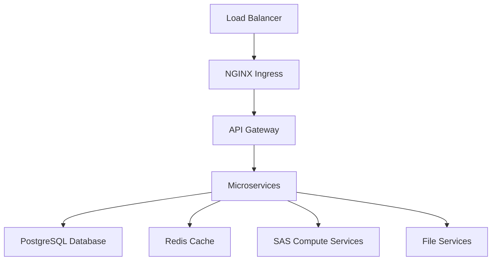

# SAS Viya Platform Administration: Best Practices and Troubleshooting

As a Senior Platform Engineer at SAS Institute, I've spent considerable time working with SAS Viya environments, optimizing their performance, and troubleshooting complex issues. This post shares the best practices and lessons learned from managing enterprise SAS Viya deployments.

## Understanding SAS Viya Architecture

SAS Viya is a cloud-native, microservices-based analytics platform. Understanding its architecture is crucial for effective administration:



### Key Components

- **NGINX Ingress Controller**: Routes traffic to microservices
- **PostgreSQL**: Primary database for metadata and configuration
- **Redis**: Caching layer for session management
- **SAS Compute Services**: Analytics processing engines
- **File Services**: Object storage for data and results

## Best Practice 1: Environment Setup and Configuration

### PostgreSQL Database Optimization

```sql
-- PostgreSQL configuration for SAS Viya
-- postgresql.conf optimizations

# Memory settings
shared_buffers = 256MB
effective_cache_size = 1GB
work_mem = 4MB
maintenance_work_mem = 64MB

# Connection settings
max_connections = 200
shared_preload_libraries = 'pg_stat_statements'

# Logging for troubleshooting
log_statement = 'all'
log_duration = on
log_lock_waits = on
log_temp_files = 0

# Performance settings
random_page_cost = 1.1
effective_io_concurrency = 200
```

### Kubernetes Resource Limits

```yaml
# sas-viya-resources.yaml
apiVersion: v1
kind: ConfigMap
metadata:
  name: sas-viya-config
data:
  # Compute service resources
  compute.cpu.limit: "2000m"
  compute.memory.limit: "4Gi"
  compute.cpu.request: "500m"
  compute.memory.request: "1Gi"
  
  # Database resources
  postgres.cpu.limit: "1000m"
  postgres.memory.limit: "2Gi"
  postgres.storage.size: "100Gi"
  
  # Redis resources
  redis.cpu.limit: "500m"
  redis.memory.limit: "1Gi"
```

## Best Practice 2: Performance Monitoring

### Custom Monitoring Script

```bash
#!/bin/bash
# sas-viya-health-check.sh

# Function to check service health
check_service_health() {
    local service_name=$1
    local namespace=${2:-sas-viya}
    
    echo "Checking $service_name..."
    
    # Get pod status
    pod_status=$(kubectl get pods -n $namespace -l app=$service_name -o jsonpath='{.items[0].status.phase}')
    
    if [ "$pod_status" = "Running" ]; then
        echo "✓ $service_name is running"
        return 0
    else
        echo "✗ $service_name is not running (Status: $pod_status)"
        return 1
    fi
}

# Function to check database connections
check_database_connections() {
    local db_host=${1:-postgres}
    local db_name=${2:-sasviya}
    
    echo "Checking database connections..."
    
    # Check connection count
    connection_count=$(kubectl exec -n sas-viya deployment/postgres -- \
        psql -U sasviya -d $db_name -t -c \
        "SELECT count(*) FROM pg_stat_activity WHERE state = 'active';")
    
    if [ "$connection_count" -lt 180 ]; then
        echo "✓ Database connections: $connection_count/200"
        return 0
    else
        echo "⚠ High database connections: $connection_count/200"
        return 1
    fi
}

# Function to check disk usage
check_disk_usage() {
    local threshold=${1:-85}
    
    echo "Checking disk usage..."
    
    # Check PVC usage
    kubectl get pvc -n sas-viya -o json | jq -r '.items[] | 
        select(.status.capacity.storage | tonumber > 0) | 
        "\(.metadata.name): \(.status.used.storage // "0")/\(.status.capacity.storage)"'
}

# Main health check
main() {
    echo "=== SAS Viya Health Check ==="
    echo "Timestamp: $(date)"
    echo ""
    
    # Check core services
    check_service_health "sas-viya-api"
    check_service_health "sas-viya-compute"
    check_service_health "postgres"
    check_service_health "redis"
    
    echo ""
    
    # Check database
    check_database_connections
    
    echo ""
    
    # Check disk usage
    check_disk_usage
    
    echo ""
    echo "=== Health Check Complete ==="
}

# Run health check
main "$@"
```

### Prometheus Monitoring Configuration

```yaml
# prometheus-sas-viya.yml
apiVersion: v1
kind: ConfigMap
metadata:
  name: prometheus-sas-viya-config
data:
  prometheus.yml: |
    global:
      scrape_interval: 15s
    
    scrape_configs:
      - job_name: 'sas-viya-pods'
        kubernetes_sd_configs:
          - role: pod
            namespaces:
              names:
                - sas-viya
        relabel_configs:
          - source_labels: [__meta_kubernetes_pod_annotation_prometheus_io_scrape]
            action: keep
            regex: true
          - source_labels: [__meta_kubernetes_pod_annotation_prometheus_io_path]
            action: replace
            target_label: __metrics_path__
            regex: (.+)
      
      - job_name: 'sas-viya-services'
        kubernetes_sd_configs:
          - role: service
            namespaces:
              names:
                - sas-viya
        relabel_configs:
          - source_labels: [__meta_kubernetes_service_annotation_prometheus_io_scrape]
            action: keep
            regex: true
```

## Best Practice 3: Troubleshooting Common Issues

### Issue 1: High Memory Usage

```bash
# diagnose-memory-usage.sh
#!/bin/bash

echo "=== SAS Viya Memory Analysis ==="

# Check pod memory usage
kubectl top pods -n sas-viya --sort-by=memory

echo ""
echo "=== Memory Usage by Container ==="
kubectl get pods -n sas-viya -o json | jq -r '.items[] | 
    select(.status.containerStatuses) | 
    .metadata.name as $pod | 
    .status.containerStatuses[] | 
    "\($pod): \(.name) - Memory: \(.state.running.startedAt // "Unknown")"'

# Check for memory leaks in PostgreSQL
echo ""
echo "=== PostgreSQL Memory Analysis ==="
kubectl exec -n sas-viya deployment/postgres -- \
    psql -U sasviya -d sasviya -c "
    SELECT 
        datname,
        numbackends,
        xact_commit,
        xact_rollback,
        blks_read,
        blks_hit,
        tup_returned,
        tup_fetched,
        tup_inserted,
        tup_updated,
        tup_deleted
    FROM pg_stat_database 
    WHERE datname = 'sasviya';"
```

### Issue 2: Slow Query Performance

```sql
-- PostgreSQL query performance analysis
-- slow-queries.sql

-- Find slow queries
SELECT 
    query,
    calls,
    total_time,
    mean_time,
    stddev_time,
    rows,
    100.0 * shared_blks_hit / nullif(shared_blks_hit + shared_blks_read, 0) AS hit_percent
FROM pg_stat_statements 
WHERE mean_time > 1000  -- Queries taking more than 1 second on average
ORDER BY mean_time DESC
LIMIT 20;

-- Check for missing indexes
SELECT 
    schemaname,
    tablename,
    seq_scan,
    seq_tup_read,
    idx_scan,
    idx_tup_fetch,
    n_tup_ins,
    n_tup_upd,
    n_tup_del
FROM pg_stat_user_tables 
WHERE seq_scan > 1000  -- Tables with many sequential scans
ORDER BY seq_tup_read DESC;

-- Check database size and growth
SELECT 
    datname,
    pg_size_pretty(pg_database_size(datname)) as size,
    pg_database_size(datname) as size_bytes
FROM pg_database 
WHERE datname = 'sasviya';
```

### Issue 3: Authentication Problems

```bash
# troubleshoot-auth.sh
#!/bin/bash

echo "=== SAS Viya Authentication Troubleshooting ==="

# Check authentication service status
kubectl get pods -n sas-viya -l app=sas-viya-auth

# Check authentication logs
echo "=== Recent Authentication Logs ==="
kubectl logs -n sas-viya -l app=sas-viya-auth --tail=50

# Check Redis connectivity
echo "=== Redis Connectivity Test ==="
kubectl exec -n sas-viya deployment/redis -- redis-cli ping

# Check session data
echo "=== Active Sessions ==="
kubectl exec -n sas-viya deployment/redis -- redis-cli keys "session:*" | wc -l

# Check database authentication
echo "=== Database Authentication Test ==="
kubectl exec -n sas-viya deployment/postgres -- \
    psql -U sasviya -d sasviya -c "
    SELECT 
        usename,
        application_name,
        client_addr,
        state,
        query_start
    FROM pg_stat_activity 
    WHERE usename = 'sasviya' 
    ORDER BY query_start DESC 
    LIMIT 10;"
```

## Best Practice 4: Backup and Recovery

### Automated Backup Script

```bash
#!/bin/bash
# sas-viya-backup.sh

BACKUP_DIR="/opt/backups/sas-viya"
DATE=$(date +%Y%m%d_%H%M%S)
NAMESPACE="sas-viya"

# Create backup directory
mkdir -p $BACKUP_DIR/$DATE

echo "Starting SAS Viya backup at $(date)"

# Backup PostgreSQL database
echo "Backing up PostgreSQL database..."
kubectl exec -n $NAMESPACE deployment/postgres -- \
    pg_dump -U sasviya -d sasviya > $BACKUP_DIR/$DATE/postgres_backup.sql

# Backup Redis data
echo "Backing up Redis data..."
kubectl exec -n $NAMESPACE deployment/redis -- \
    redis-cli --rdb /tmp/redis_backup.rdb

kubectl cp $NAMESPACE/redis-pod:/tmp/redis_backup.rdb $BACKUP_DIR/$DATE/redis_backup.rdb

# Backup Kubernetes resources
echo "Backing up Kubernetes resources..."
kubectl get all -n $NAMESPACE -o yaml > $BACKUP_DIR/$DATE/kubernetes_resources.yaml

# Backup PVC data
echo "Backing up persistent volume claims..."
kubectl get pvc -n $NAMESPACE -o yaml > $BACKUP_DIR/$DATE/pvc_backup.yaml

# Compress backup
echo "Compressing backup..."
cd $BACKUP_DIR
tar -czf sas-viya-backup-$DATE.tar.gz $DATE/
rm -rf $DATE/

echo "Backup completed at $(date)"
echo "Backup file: $BACKUP_DIR/sas-viya-backup-$DATE.tar.gz"

# Upload to S3 (optional)
if [ -n "$S3_BUCKET" ]; then
    echo "Uploading backup to S3..."
    aws s3 cp $BACKUP_DIR/sas-viya-backup-$DATE.tar.gz s3://$S3_BUCKET/backups/
fi

# Cleanup old backups (keep last 7 days)
find $BACKUP_DIR -name "sas-viya-backup-*.tar.gz" -mtime +7 -delete
```

### Recovery Procedure

```bash
#!/bin/bash
# sas-viya-restore.sh

BACKUP_FILE=$1
NAMESPACE="sas-viya"

if [ -z "$BACKUP_FILE" ]; then
    echo "Usage: $0 <backup-file>"
    exit 1
fi

echo "Starting SAS Viya restore from $BACKUP_FILE"

# Extract backup
TEMP_DIR=$(mktemp -d)
tar -xzf $BACKUP_FILE -C $TEMP_DIR
BACKUP_DIR=$(ls -d $TEMP_DIR/*)

# Stop SAS Viya services
echo "Stopping SAS Viya services..."
kubectl scale deployment --all --replicas=0 -n $NAMESPACE

# Restore PostgreSQL database
echo "Restoring PostgreSQL database..."
kubectl exec -n $NAMESPACE deployment/postgres -- \
    psql -U sasviya -d sasviya < $BACKUP_DIR/postgres_backup.sql

# Restore Redis data
echo "Restoring Redis data..."
kubectl cp $BACKUP_DIR/redis_backup.rdb $NAMESPACE/redis-pod:/tmp/redis_backup.rdb
kubectl exec -n $NAMESPACE deployment/redis -- \
    redis-cli --rdb /tmp/redis_backup.rdb

# Restore Kubernetes resources
echo "Restoring Kubernetes resources..."
kubectl apply -f $BACKUP_DIR/kubernetes_resources.yaml

# Start services
echo "Starting SAS Viya services..."
kubectl scale deployment --all --replicas=1 -n $NAMESPACE

# Wait for services to be ready
echo "Waiting for services to be ready..."
kubectl wait --for=condition=available --timeout=300s deployment -n $NAMESPACE

# Cleanup
rm -rf $TEMP_DIR

echo "Restore completed at $(date)"
```

## Best Practice 5: Security Hardening

### Network Policies

```yaml
# network-policies.yaml
apiVersion: networking.k8s.io/v1
kind: NetworkPolicy
metadata:
  name: sas-viya-network-policy
  namespace: sas-viya
spec:
  podSelector: {}
  policyTypes:
  - Ingress
  - Egress
  ingress:
  - from:
    - namespaceSelector:
        matchLabels:
          name: sas-viya
    - podSelector:
        matchLabels:
          app: sas-viya-api
  egress:
  - to:
    - namespaceSelector:
        matchLabels:
          name: sas-viya
    ports:
    - protocol: TCP
      port: 5432  # PostgreSQL
    - protocol: TCP
      port: 6379  # Redis
```

### RBAC Configuration

```yaml
# rbac.yaml
apiVersion: rbac.authorization.k8s.io/v1
kind: Role
metadata:
  namespace: sas-viya
  name: sas-viya-admin
rules:
- apiGroups: [""]
  resources: ["pods", "services", "configmaps", "secrets"]
  verbs: ["get", "list", "watch", "create", "update", "patch", "delete"]
- apiGroups: ["apps"]
  resources: ["deployments", "replicasets"]
  verbs: ["get", "list", "watch", "create", "update", "patch", "delete"]
---
apiVersion: rbac.authorization.k8s.io/v1
kind: RoleBinding
metadata:
  name: sas-viya-admin-binding
  namespace: sas-viya
subjects:
- kind: User
  name: sas-viya-admin
  apiGroup: rbac.authorization.k8s.io
roleRef:
  kind: Role
  name: sas-viya-admin
  apiGroup: rbac.authorization.k8s.io
```

## Performance Optimization Tips

### 1. Database Optimization

```sql
-- Create indexes for frequently queried tables
CREATE INDEX CONCURRENTLY idx_sas_viya_users_email ON sas_viya.users(email);
CREATE INDEX CONCURRENTLY idx_sas_viya_sessions_user_id ON sas_viya.sessions(user_id);
CREATE INDEX CONCURRENTLY idx_sas_viya_logs_timestamp ON sas_viya.logs(created_at);

-- Analyze table statistics
ANALYZE sas_viya.users;
ANALYZE sas_viya.sessions;
ANALYZE sas_viya.logs;
```

### 2. Kubernetes Resource Optimization

```yaml
# resource-optimization.yaml
apiVersion: v1
kind: ConfigMap
metadata:
  name: sas-viya-performance-config
data:
  # JVM settings for compute services
  JAVA_OPTS: "-Xms1g -Xmx2g -XX:+UseG1GC -XX:MaxGCPauseMillis=200"
  
  # NGINX worker processes
  NGINX_WORKER_PROCESSES: "auto"
  NGINX_WORKER_CONNECTIONS: "1024"
  
  # PostgreSQL shared memory
  POSTGRES_SHARED_BUFFERS: "256MB"
  POSTGRES_EFFECTIVE_CACHE_SIZE: "1GB"
```

## Conclusion

Effective SAS Viya administration requires a deep understanding of its architecture, proactive monitoring, and systematic troubleshooting approaches. The key is to:

1. **Monitor proactively** - Set up comprehensive monitoring before issues occur
2. **Optimize systematically** - Focus on database and resource optimization
3. **Backup regularly** - Implement automated backup and recovery procedures
4. **Secure comprehensively** - Apply defense-in-depth security principles
5. **Document everything** - Maintain detailed runbooks and procedures

These practices have helped me maintain high availability and performance in enterprise SAS Viya environments, ensuring reliable analytics capabilities for business users.

---

*Have you worked with SAS Viya or similar analytics platforms? I'd love to hear about your experiences and any additional tips you've discovered. Connect with me on [LinkedIn](https://www.linkedin.com/in/ajitbhaskaran/) or reach out via email at ajit.kanoli@gmail.com.*

