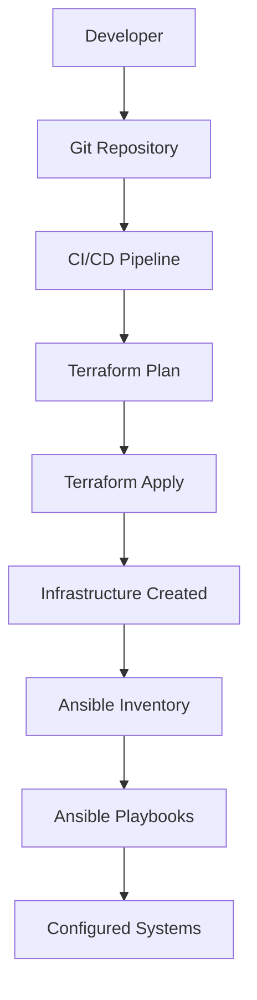

# Building Resilient Infrastructure with Terraform and Ansible

In my role as a Platform Engineer, I've found that combining **Terraform** for infrastructure provisioning and **Ansible** for configuration management creates a powerful, flexible automation stack. This post shares the best practices I've learned from implementing this approach across multiple enterprise environments.

## Why Terraform + Ansible?

### Terraform's Strengths
- **Declarative Infrastructure**: Define what you want, not how to get there
- **State Management**: Tracks infrastructure changes and dependencies
- **Multi-Cloud Support**: Works across AWS, Azure, GCP, and more
- **Plan Before Apply**: Preview changes before execution

### Ansible's Strengths
- **Configuration Management**: Detailed system configuration
- **Idempotent**: Safe to run multiple times
- **Agentless**: No agents required on target systems
- **Rich Module Ecosystem**: Extensive library of pre-built modules

## Architecture Overview



## Best Practice 1: Separate Concerns

### Terraform: Infrastructure Provisioning
```hcl
# main.tf - Infrastructure definition
resource "aws_instance" "web_server" {
  ami           = data.aws_ami.ubuntu.id
  instance_type = var.instance_type
  key_name      = aws_key_pair.deployer.key_name
  
  vpc_security_group_ids = [aws_security_group.web.id]
  subnet_id              = aws_subnet.public.id
  
  tags = {
    Name        = "web-server"
    Environment = var.environment
    ManagedBy   = "terraform"
    AnsibleHost = "web-server"
  }
}

# Output for Ansible inventory
output "web_server_ip" {
  value = aws_instance.web_server.public_ip
}
```

### Ansible: Configuration Management
```yaml
# playbooks/webserver.yml
---
- name: Configure Web Server
  hosts: web_servers
  become: yes
  vars:
    app_version: "{{ lookup('env', 'APP_VERSION') }}"
  
  tasks:
    - name: Update system packages
      apt:
        update_cache: yes
        upgrade: yes
      
    - name: Install Nginx
      apt:
        name: nginx
        state: present
      
    - name: Configure Nginx
      template:
        src: nginx.conf.j2
        dest: /etc/nginx/nginx.conf
        backup: yes
      notify: restart nginx
      
    - name: Start and enable Nginx
      systemd:
        name: nginx
        state: started
        enabled: yes
        
  handlers:
    - name: restart nginx
      systemd:
        name: nginx
        state: restarted
```

## Best Practice 2: Dynamic Inventory Generation

Create an Ansible inventory from Terraform outputs:

```python
# scripts/terraform-to-ansible.py
import json
import subprocess
import sys

def get_terraform_output():
    """Get Terraform outputs as JSON"""
    result = subprocess.run(
        ['terraform', 'output', '-json'],
        capture_output=True,
        text=True,
        check=True
    )
    return json.loads(result.stdout)

def generate_ansible_inventory(terraform_output):
    """Generate Ansible inventory from Terraform outputs"""
    inventory = {
        'web_servers': {
            'hosts': [],
            'vars': {
                'ansible_user': 'ubuntu',
                'ansible_ssh_private_key_file': '~/.ssh/id_rsa'
            }
        },
        'db_servers': {
            'hosts': [],
            'vars': {
                'ansible_user': 'ubuntu',
                'ansible_ssh_private_key_file': '~/.ssh/id_rsa'
            }
        }
    }
    
    # Add web servers
    if 'web_server_ips' in terraform_output:
        inventory['web_servers']['hosts'] = terraform_output['web_server_ips']['value']
    
    # Add database servers
    if 'db_server_ips' in terraform_output:
        inventory['db_servers']['hosts'] = terraform_output['db_server_ips']['value']
    
    return inventory

if __name__ == "__main__":
    terraform_output = get_terraform_output()
    inventory = generate_ansible_inventory(terraform_output)
    
    # Write inventory file
    with open('inventory/dynamic_inventory.yml', 'w') as f:
        yaml.dump(inventory, f, default_flow_style=False)
    
    print("Dynamic inventory generated successfully")
```

## Best Practice 3: State Management

### Terraform State Best Practices

```hcl
# backend.tf - Remote state configuration
terraform {
  backend "s3" {
    bucket         = "my-terraform-state-bucket"
    key            = "infrastructure/terraform.tfstate"
    region         = "us-west-2"
    encrypt        = true
    dynamodb_table = "terraform-state-lock"
  }
}

# Use data sources to reference existing resources
data "aws_vpc" "main" {
  tags = {
    Name = "main-vpc"
  }
}
```

### Ansible State Management

```yaml
# playbooks/state-management.yml
---
- name: System State Management
  hosts: all
  become: yes
  
  tasks:
    - name: Create state directory
      file:
        path: /opt/ansible-state
        state: directory
        mode: '0755'
    
    - name: Record package installation state
      copy:
        content: "{{ ansible_date_time.iso8601 }}: Packages updated"
        dest: /opt/ansible-state/last-update
      when: package_updates.changed
```

## Best Practice 4: Error Handling and Rollback

### Terraform Error Handling

```hcl
# variables.tf - Input validation
variable "instance_count" {
  description = "Number of instances to create"
  type        = number
  default     = 1
  
  validation {
    condition     = var.instance_count > 0 && var.instance_count <= 10
    error_message = "Instance count must be between 1 and 10."
  }
}

# Use lifecycle rules for controlled updates
resource "aws_instance" "web_server" {
  # ... configuration ...
  
  lifecycle {
    create_before_destroy = true
    prevent_destroy      = true  # For production resources
  }
}
```

### Ansible Error Handling

```yaml
# playbooks/error-handling.yml
---
- name: Robust Configuration Management
  hosts: all
  become: yes
  
  tasks:
    - name: Backup current configuration
      copy:
        src: /etc/nginx/nginx.conf
        dest: "/opt/backups/nginx.conf.{{ ansible_date_time.epoch }}"
      register: backup_result
      
    - name: Apply configuration changes
      template:
        src: nginx.conf.j2
        dest: /etc/nginx/nginx.conf
      register: config_result
      
    - name: Test configuration
      command: nginx -t
      register: nginx_test
      failed_when: nginx_test.rc != 0
      
    - name: Rollback on failure
      copy:
        src: "{{ backup_result.dest }}"
        dest: /etc/nginx/nginx.conf
      when: nginx_test.failed
      
    - name: Restart service
      systemd:
        name: nginx
        state: restarted
      when: config_result.changed and not nginx_test.failed
```

## Best Practice 5: Testing Strategy

### Terraform Testing

```hcl
# tests/terraform_test.go
package test

import (
    "testing"
    "github.com/gruntwork-io/terratest/modules/terraform"
    "github.com/stretchr/testify/assert"
)

func TestTerraformInfrastructure(t *testing.T) {
    terraformOptions := &terraform.Options{
        TerraformDir: "../",
        VarFiles:     []string{"test.tfvars"},
    }
    
    defer terraform.Destroy(t, terraformOptions)
    terraform.InitAndApply(t, terraformOptions)
    
    // Test outputs
    instanceID := terraform.Output(t, terraformOptions, "instance_id")
    assert.NotEmpty(t, instanceID)
}
```

### Ansible Testing

```bash
#!/bin/bash
# test-ansible.sh - Ansible testing script

set -e

echo "Running Ansible syntax check..."
ansible-playbook --syntax-check playbooks/*.yml

echo "Running Ansible dry-run..."
ansible-playbook --check --diff playbooks/webserver.yml

echo "Running Ansible tests..."
ansible-playbook playbooks/test.yml

echo "All tests passed!"
```

## Best Practice 6: CI/CD Integration

```yaml
# .github/workflows/terraform-ansible.yml
name: Infrastructure Pipeline

on:
  push:
    paths:
      - 'terraform/**'
      - 'ansible/**'

jobs:
  terraform:
    runs-on: ubuntu-latest
    steps:
      - uses: actions/checkout@v3
      
      - name: Setup Terraform
        uses: hashicorp/setup-terraform@v2
        
      - name: Terraform Init
        run: terraform init
        
      - name: Terraform Plan
        run: terraform plan -out=tfplan
        
      - name: Terraform Apply
        if: github.ref == 'refs/heads/main'
        run: terraform apply tfplan
        
      - name: Generate Ansible Inventory
        run: python scripts/terraform-to-ansible.py
        
      - name: Run Ansible Playbooks
        run: |
          ansible-playbook -i inventory/dynamic_inventory.yml playbooks/webserver.yml
```

## Monitoring and Observability

### Infrastructure Monitoring

```hcl
# monitoring.tf - CloudWatch alarms
resource "aws_cloudwatch_metric_alarm" "high_cpu" {
  alarm_name          = "high-cpu-utilization"
  comparison_operator = "GreaterThanThreshold"
  evaluation_periods  = "2"
  metric_name         = "CPUUtilization"
  namespace           = "AWS/EC2"
  period              = "120"
  statistic           = "Average"
  threshold           = "80"
  alarm_description   = "This metric monitors ec2 cpu utilization"
  
  dimensions = {
    InstanceId = aws_instance.web_server.id
  }
}
```

### Application Monitoring

```yaml
# playbooks/monitoring.yml
---
- name: Setup Application Monitoring
  hosts: web_servers
  become: yes
  
  tasks:
    - name: Install monitoring agent
      apt:
        name: prometheus-node-exporter
        state: present
        
    - name: Configure monitoring
      template:
        src: monitoring.conf.j2
        dest: /etc/prometheus/node_exporter.conf
        
    - name: Start monitoring service
      systemd:
        name: prometheus-node-exporter
        state: started
        enabled: yes
```

## Conclusion

Combining Terraform and Ansible provides a powerful foundation for infrastructure automation. The key is to:

1. **Separate concerns** - Terraform for infrastructure, Ansible for configuration
2. **Use dynamic inventories** - Keep Ansible in sync with Terraform
3. **Implement proper state management** - Both tools need reliable state tracking
4. **Handle errors gracefully** - Plan for failures and rollbacks
5. **Test everything** - Infrastructure code needs testing too
6. **Integrate with CI/CD** - Automate the automation

This approach has served me well across multiple enterprise environments, providing both flexibility and reliability in infrastructure management.

---

*What challenges have you faced with Terraform and Ansible integration? Share your experiences in the comments below or reach out on [LinkedIn](https://www.linkedin.com/in/ajitbhaskaran/).*

